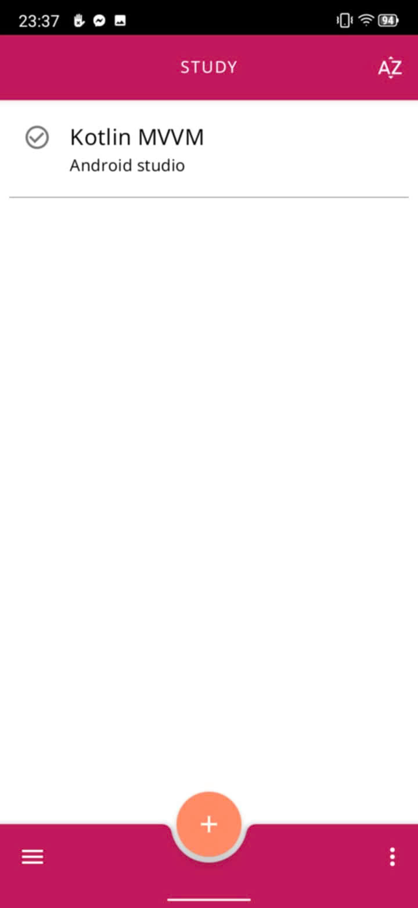

# Todo

## Hình ảnh
<table>
  <tr>
    <td></td>
    <td></td>
    <td></td>
   </tr> 
   <tr>
      <td></td>
      <td></td>
      <td></td>
  </tr>
</table>

## Công nghệ sử dụng
### Room Database w/ Coroutine
- Sử dụng một số tính năng nâng cao: nhiều bảng, quan hệ 1-n, n-n.
- Sử dụng kèm Repository Pattern. IO Database sử dụng Coroutine trong ViewModelScope và không sử
  dụng LiveData trong DAO.

### MVVM - LiveData - ViewBinding

- Chia ViewModel dựa theo Model Class. App có sử dụng SharedViewModel
- LiveData chủ yếu để update trong ViewModel, observed từ ngoài View.
- ViewBinding

## Tính năng

- Lưu nhắc nhở 3 cấp: Workspace(Group) / Task / Subtask
- Xem các nhắc nhở đã lưu trữ
- Lưu thời hạn deadline
- Sắp xếp theo thời gian thêm, thời gian chỉnh sửa gần nhất, deadline gần nhất

